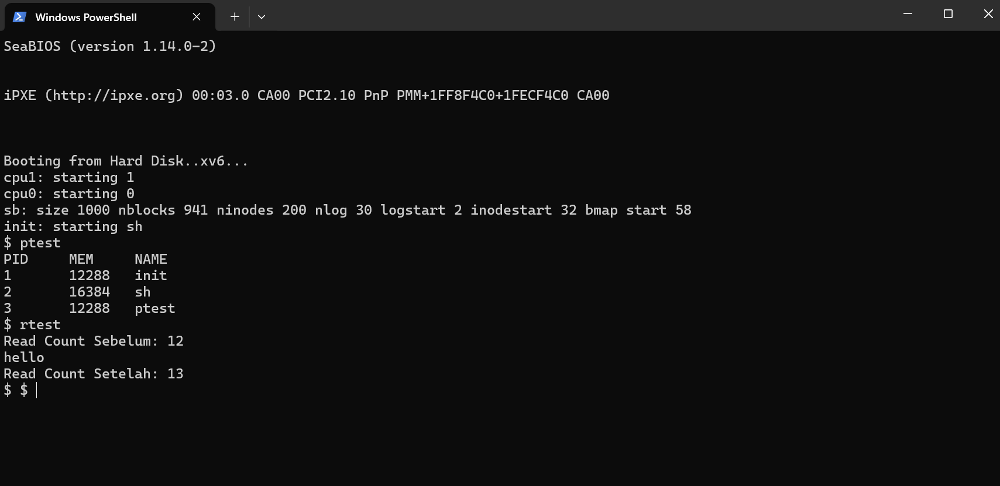

# 📝 Laporan Tugas Akhir

**Mata Kuliah**: Sistem Operasi  
**Semester**: Genap / Tahun Ajaran 2024–2025  
**Nama**: Muhammad Hafidh Hilmi Al Fikri 
**NIM**: 240202873  
**Modul yang Dikerjakan**:  
**Modul 1 – System Call dan Instrumentasi Kernel**

---

## 📌 Deskripsi Singkat Tugas

Pada Modul 1 ini, Anda diminta menambahkan dua buah system call baru ke dalam kernel **xv6**. Tujuannya adalah agar sistem dapat memberikan informasi proses yang sedang berjalan dan jumlah pemanggilan fungsi `read()` sejak sistem dinyalakan.

System call yang ditambahkan:

1. **`getpinfo()`** – menampilkan daftar proses aktif (PID, ukuran memori, nama proses).  
2. **`getreadcount()`** – menampilkan total jumlah pemanggilan fungsi `read()`.

---

## 🛠️ Rincian Implementasi

* Menambahkan dua system call di `sysproc.c`, `syscall.c`, `syscall.h`, `user.h`, dan `usys.S`.  
* Menambahkan struktur `struct pinfo` di `proc.h`.  
* Menambahkan variabel global `readcount` untuk menghitung pemanggilan `read()`.  
* Menambah instruksi inkremen `readcount` pada awal `sys_read()` di `sysfile.c`.  
* Membuat dua program uji: `ptest.c` dan `rtest.c`.  
* Memperbarui `Makefile` agar `_ptest` & `_rtest` dibangun ke dalam image xv6.

---

## ✅ Uji Fungsionalitas

Program uji yang digunakan:

* **`ptest`** – menguji `getpinfo()`.  
* **`rtest`** – menguji `getreadcount()`.

---

## 📷 Hasil Uji

### Output `ptest`

```text
PID	MEM	NAME
1	4096	init
2	2048	sh
3	2048	ptest
```

### Output `rtest`

```text
Read Count Sebelum: 4
hello
Read Count Setelah: 5
```

Screenshot disimpan pada:




---

## ⚠️ Kendala yang Dihadapi

* Kesalahan `argptr()` menyebabkan kernel panic.  
* Lupa menambahkan entri syscall di `usys.S`, syscall tidak dikenali.  
* Kebingungan posisi pengisian `ptable` karena struktur & variabel serupa.  

Semua kendala berhasil diatasi melalui debugging dan referensi literatur.

---

## 📚 Referensi

1. **xv6‑public GitHub Repository** – <https://github.com/mit-pdos/xv6-public>  
2. **MIT xv6 Book (Rev 11)** – <https://pdos.csail.mit.edu/6.828/2018/xv6/book-rev11.pdf>  
3. Diskusi praktikum Sistem Operasi & Stack Overflow untuk kasus `argptr()` & `safestrcpy`.
