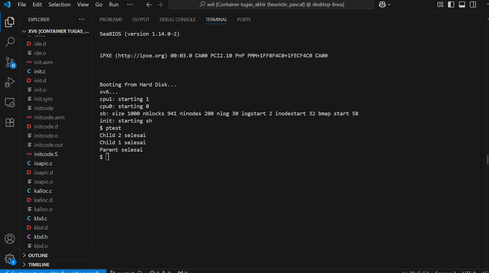

# 📝 Laporan Tugas Akhir

**Mata Kuliah**: Sistem Operasi  
**Semester**: Genap / Tahun Ajaran 2024–2025  
**Nama**: Muhammad Haidh Hilmi Al Fikri 
**NIM**: 240202873 
**Modul yang Dikerjakan**:  
**Modul 2 – Penjadwalan CPU Lanjutan (Priority Scheduling Non-Preemptive)**

---

## 📌 Deskripsi Singkat Tugas

Modul ini berfokus pada modifikasi algoritma penjadwalan proses di xv6 dari **Round Robin** menjadi **Non-Preemptive Priority Scheduling**. Dengan algoritma ini, hanya proses dengan prioritas tertinggi (nilai terkecil) yang akan dijalankan terlebih dahulu, tanpa ada preemption oleh proses lain.

Fitur yang ditambahkan:
1. Penambahan field `priority` pada struktur proses (`struct proc`)
2. Penambahan system call baru `set_priority(int)` untuk mengatur prioritas proses
3. Modifikasi fungsi `scheduler()` untuk memilih proses berdasarkan prioritas

---

## 🛠️ Rincian Implementasi

* Menambahkan field `priority` pada `struct proc` di `proc.h`
* Menginisialisasi `priority` default pada `allocproc()` di `proc.c`
* Menambahkan system call baru `set_priority(int)` di `sysproc.c`
* Registrasi syscall ke `syscall.c`, `syscall.h`, `user.h`, `usys.S`
* Memodifikasi fungsi `scheduler()` untuk menggunakan prioritas proses
* Menambahkan program uji `ptest.c`
* Menambahkan entri `_ptest` ke `Makefile`

---

## ✅ Uji Fungsionalitas

Program uji: `ptest`  
Fungsi program: membuat dua proses anak dengan prioritas berbeda dan melihat urutan eksekusi berdasarkan prioritas.

---

## 📷 Hasil Uji

### Output `ptest`

```
Child 2 selesai   // prioritas tinggi (10)
Child 1 selesai   // prioritas rendah (90)
Parent selesai
```


---

## ⚠️ Kendala yang Dihadapi

* Lupa menambahkan entri syscall di `usys.S`
* Kesalahan logika dalam pemilihan proses dengan prioritas tertinggi
* Proses tidak berjalan sesuai urutan karena lupa menggunakan kondisi `RUNNABLE`

---

## 📚 Referensi

1. [MIT xv6 Book (x86)](https://pdos.csail.mit.edu/6.828/2018/xv6/book-rev11.pdf)
2. [xv6-public GitHub](https://github.com/mit-pdos/xv6-public)
3. Diskusi praktikum dan debugging bersama rekan

---

## 📝 Kesimpulan

Dengan implementasi ini, sistem berhasil diubah dari round-robin menjadi penjadwalan prioritas non-preemptive. Proses dengan prioritas lebih tinggi dieksekusi terlebih dahulu, menunjukkan keberhasilan modifikasi scheduler dan penggunaan system call baru.
