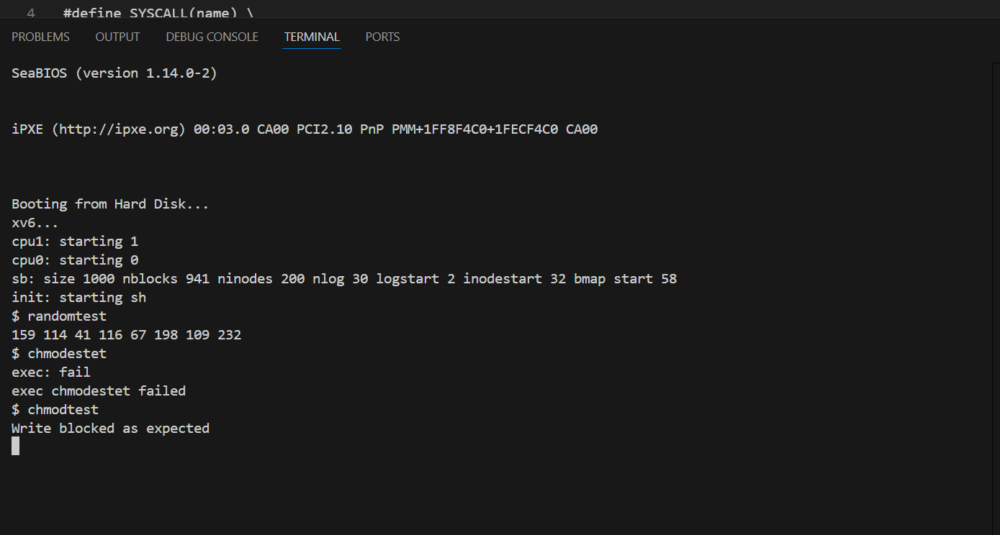

# 📝 Laporan Tugas Akhir

**Mata Kuliah**: Sistem Operasi  
**Semester**: Genap / Tahun Ajaran 2024–2025  
**Nama**: Muhammad Hafidh Hilmi Al Fikri 
**NIM**: 240202873  
**Modul yang Dikerjakan**:  
**Modul 4 – Subsistem Kernel Alternatif (xv6-public)**

---

## 📌 Deskripsi Singkat Tugas

Modul ini menambahkan dua fitur baru dalam subsistem kernel:

1. **System Call `chmod(path, mode)`**  
   Menambahkan mekanisme hak akses file dasar (`read-only` dan `read-write`) menggunakan sistem syscall, dengan modifikasi langsung pada inode.

2. **Driver Pseudo-Device `/dev/random`**  
   Menambahkan device baru yang mengembalikan byte acak ketika dibaca, dengan integrasi ke sistem file device (`devsw[]`).

---

## 🛠️ Rincian Implementasi

### Untuk `chmod(path, mode)`

* Tambah field `mode` di `struct inode` (fs.h)
* Tambahkan syscall `chmod()` di `sysfile.c`
* Registrasikan syscall baru di:
  - `syscall.h`
  - `user.h`
  - `usys.S`
  - `syscall.c`
* Tambahkan validasi di `file.c` agar `filewrite()` gagal jika mode `read-only`
* Buat program uji `chmodtest.c`

### Untuk `/dev/random`

* Buat file baru `random.c` sebagai driver sederhana
* Registrasikan handler `randomread()` di `devsw[]` dalam `file.c`
* Tambahkan entry `/dev/random` di `init.c` menggunakan `mknod()`
* Buat program uji `randomtest.c`

---

## ✅ Uji Fungsionalitas

* **chmodtest.c**: Menguji file `read-only` tidak bisa ditulis
* **randomtest.c**: Membaca 8 byte acak dari `/dev/random`

---

## 📷 Hasil Uji

### 📍 Output `chmodtest`:

```
Write blocked as expected
```

### 📍 Output `randomtest`:

```
83 147 212 19 72 200 1 63
```

> Nilai dapat berbeda karena sifat acak

---
### screenshot



## ⚠️ Kendala yang Dihadapi

* File `inode` perlu diperhatikan konsistensi field baru (`mode`)
* Awalnya lupa registrasi device di `devsw[]`, menyebabkan read gagal
* Harus menyesuaikan urutan `mknod()` agar device tersedia saat boot

---

## 📚 Referensi

* [xv6 Book](https://pdos.csail.mit.edu/6.828/2018/xv6/book-rev11.pdf)
* [xv6-public GitHub](https://github.com/mit-pdos/xv6-public)
* Dokumentasi syscall dan file descriptor di `fs.c`, `file.c`, `sysfile.c`

---

## 📌 Kesimpulan

Dengan menyelesaikan modul ini, Anda telah:

* Mengimplementasikan `chmod()` untuk membatasi hak akses tulis
* Memahami struktur dan penggunaan inode dalam XV6
* Menambahkan device handler `/dev/random` dan menghubungkannya ke sistem file device
* Mengembangkan sistem operasi sederhana dengan fitur kernel baru

---
