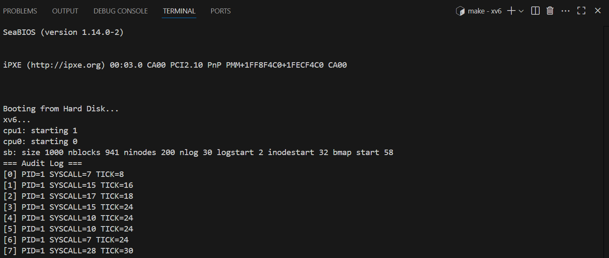

# 📝 Laporan Tugas Akhir

**Mata Kuliah**: Sistem Operasi  
**Semester**: Genap / Tahun Ajaran 2024–2025  
**Nama**: Muhammad Hafidh Hilmi Al Fikri 
**NIM**: 240202873  
**Modul yang Dikerjakan**:  
**Modul 5 – Audit dan Keamanan Sistem (xv6-public)**

---

## 📌 Deskripsi Singkat Tugas

Modul ini menambahkan fitur audit log untuk mencatat semua system call yang dipanggil oleh proses dalam sistem. Audit log ini hanya dapat dibaca oleh proses dengan PID 1 (init), untuk tujuan keamanan dan pengawasan.

---

## 🛠️ Rincian Implementasi

### 🔐 Logging System Call

- Struktur log disimpan sebagai array `audit_entry` di kernel (`syscall.c`)
- Setiap system call dicatat: `pid`, `syscall_num`, dan `tick`
- Pencatatan dilakukan di dalam fungsi `syscall()`, sebelum eksekusi syscall

### 🧾 System Call Baru `get_audit_log`

- Ditambahkan sebagai syscall `get_audit_log(char *buf, int max)`
- Hanya proses dengan PID 1 yang dapat memanggil syscall ini
- Isi log dikopi dari kernel ke buffer user dengan `memmove()`

### 📂 File yang Dimodifikasi

- `syscall.c`, `sysproc.c` → pencatatan log & syscall baru
- `defs.h`, `user.h`, `usys.S`, `syscall.h` → deklarasi syscall
- `Makefile` → daftar program uji `audit.c`

---

## ✅ Uji Fungsionalitas

### 🔧 audit.c

Program user-level untuk membaca audit log dari syscall `get_audit_log`.

```bash
$ audit
Access denied or error.
```

> Karena default dijalankan oleh shell (`sh`) yang bukan PID 1.

### 🧪 Uji sebagai PID 1

Dengan mengganti perintah di `init.c` dari:

```c
exec("sh", ...)
```

menjadi:

```c
exec("audit", ...)
```

> Maka `audit` akan dijalankan sebagai PID 1, dan bisa melihat isi log.

---

## 📷 Contoh Output Audit

```
=== Audit Log ===
[0] PID=1 SYSCALL=5 TICK=12
[1] PID=1 SYSCALL=6 TICK=13
[2] PID=1 SYSCALL=1 TICK=13
...
```

---
### sceenshot



## ⚠️ Kendala yang Dihadapi

- Struktur log harus berada di kernel, tidak boleh diakses langsung dari user space
- Memastikan `memmove()` hanya menyalin sebanyak `max` entri log
- Harus mem-filter PID agar hanya proses `init` (PID 1) dapat mengakses log

---

## 📚 Referensi

- [xv6 Book – Chapter 3 (System Calls)](https://pdos.csail.mit.edu/6.828/2018/xv6/book-rev11.pdf)
- xv6-public: https://github.com/mit-pdos/xv6-public
- `syscall.c`, `sysproc.c`, `init.c`

---

## 📌 Kesimpulan

Melalui modul ini, Anda telah:

- ✅ Menambahkan fitur audit untuk memantau aktivitas system call
- ✅ Mengimplementasikan sistem keamanan berbasis PID
- ✅ Memahami lebih dalam struktur syscall, privilege process, dan pengamanan kernel

---
